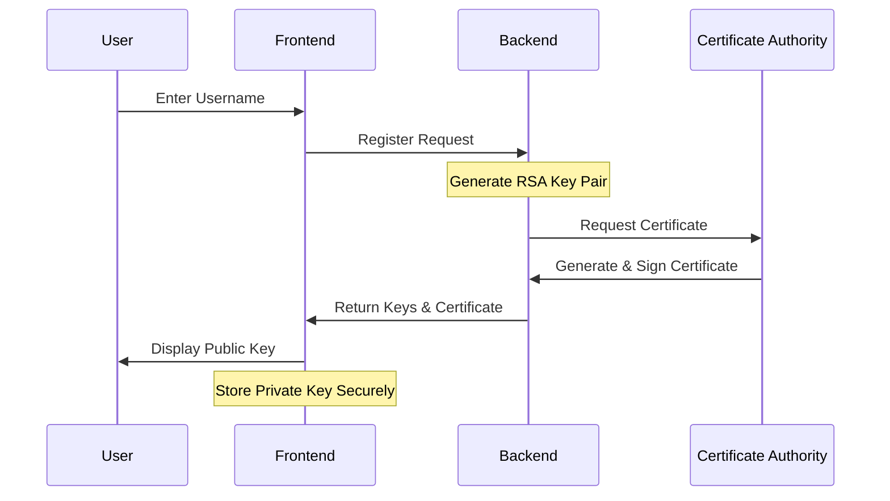
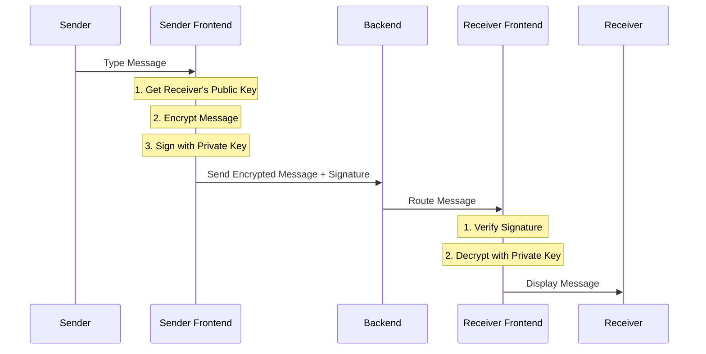
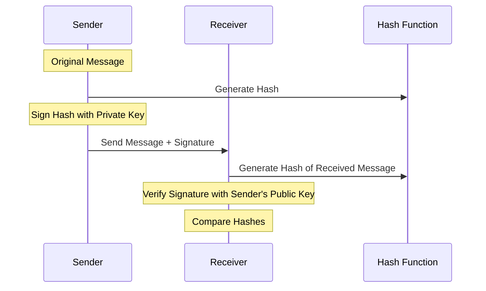
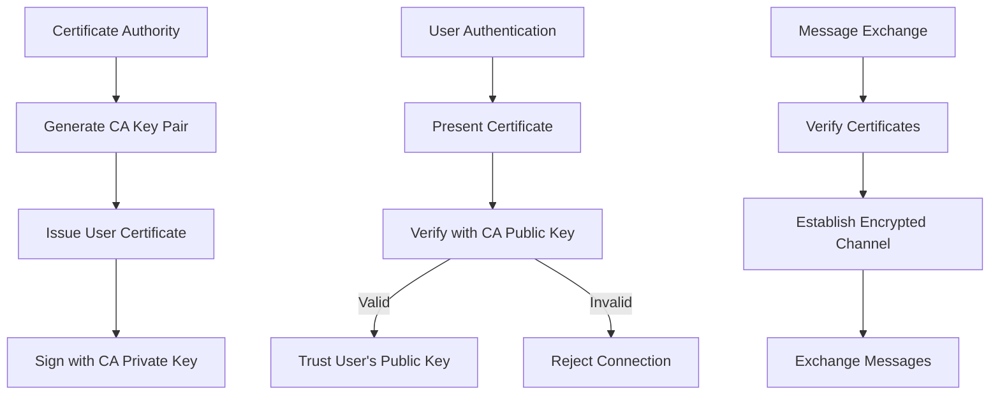
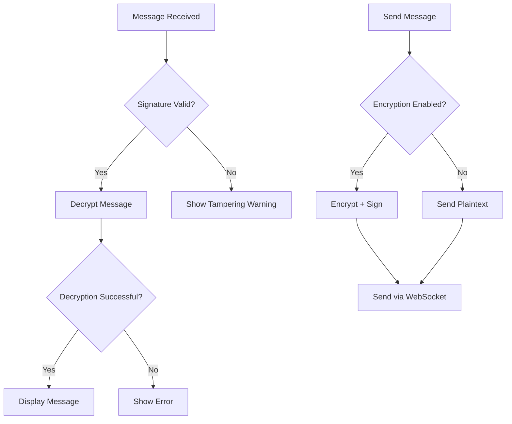

# RSA-Based Secure Messaging App - Technical Documentation

## Team Members
- Cheong Choonvai
- Rauth
- Chhay Lyhour
- Srengkoang Cheang

## Table of Contents
1. [Project Overview](#project-overview)
2. [System Architecture](#system-architecture)
3. [Security Implementation](#security-implementation)
4. [Technical Components](#technical-components)
5. [Application Flows and Diagrams](#application-flows-and-diagrams)
6. [Development Setup](#development-setup)
7. [Testing and Validation](#testing-and-validation)
8. [Dependencies](#dependencies)
9. [Future Considerations](#future-considerations)

## Project Overview

### Purpose
The RSA-Based Secure Messaging App demonstrates end-to-end encryption using RSA digital signatures in a real-time messaging environment. It serves as both an educational tool and a practical implementation of modern cryptographic principles.

### Key Features
- End-to-end encryption with RSA
- Digital signature implementation
- Real-time messaging via WebSocket
- Man-in-the-Middle (MITM) attack simulation
- Toggle between encrypted/unencrypted modes
- Certificate Authority (CA) integration
- Comprehensive security logging

## System Architecture

### Frontend (React + Vite)
- **User Interface**: Modern, responsive design using React and Tailwind CSS
- **Real-time Communication**: Socket.IO client for WebSocket connections
- **State Management**: React hooks for local state management
- **Encryption Handling**: Client-side RSA encryption/decryption

### Backend (Flask)
- **Server**: Flask server with Flask-SocketIO for real-time messaging
- **Cryptography**: PyCryptodome for RSA implementation
- **Message Handling**: Real-time message routing and storage
- **Certificate Authority**: User authentication and key verification

## Security Implementation

### 1. End-to-End Encryption
- RSA key pair generation for each user
- Public key exchange during registration
- Message encryption using recipient's public key
- Message decryption using recipient's private key

### 2. Digital Signatures
- Message signing with sender's private key
- Signature verification using sender's public key
- Tamper detection through signature validation
- Certificate-based user authentication

### 3. MITM Attack Prevention
- Certificate Authority (CA) implementation
- User certificate generation and validation
- Public key verification through certificates
- Encrypted channel for key exchange

## Technical Components

### RSA Algorithm Implementation

#### Key Generation
\`\`\`python
def generate_key_pair():
    # Generate two large prime numbers
    p = generate_prime()
    q = generate_prime()
    
    # Calculate modulus
    n = p * q
    
    # Calculate totient
    phi = (p - 1) * (q - 1)
    
    # Choose public exponent (commonly 65537)
    e = 65537
    
    # Calculate private exponent
    d = mod_inverse(e, phi)
    
    return ((n, e), (n, d))  # (public_key, private_key)
\`\`\`

#### Encryption Process
\`\`\`
c = m^e mod n
where:
c = ciphertext
m = message
e = public exponent
n = modulus
\`\`\`

#### Decryption Process
\`\`\`
m = c^d mod n
where:
c = ciphertext
d = private exponent
n = modulus
m = original message
\`\`\`

### Core Components

1. **RSA Implementation** (\`app/crypto/rsa_utils.py\`)
   - Implements RSA key generation
   - Handles message encryption/decryption
   - Manages digital signatures
   - Provides certificate management

2. **Message Handler** (\`app/backend/message_handler.py\`)
   - Manages real-time message routing
   - Implements WebSocket communication
   - Handles encryption and signatures
   - Manages user sessions

3. **Frontend Components**
   - Authentication (\`Login.jsx\`)
   - Chat Interface (\`Chat.jsx\`)
   - Security Information Panel (\`SecurityInfo.jsx\`)
   - Message Status Indicators

## Application Flows and Diagrams

### User Registration and Key Generation Flow

### Encrypted Message Flow

### Digital Signature Process

### MITM Attack Prevention

### Error Handling Flow

## Development Setup

### Backend Setup
\`\`\`bash
# Install Python dependencies
pip install -r requirements.txt

# Start the Flask server
python app.py
\`\`\`

### Frontend Setup
\`\`\`bash
# Navigate to client directory
cd client

# Install Node dependencies
npm install

# Start the development server
npm run dev
\`\`\`

## Testing and Validation

### Attack Simulation
The application includes an attacker simulation (\`attacker.py\`) that demonstrates:
1. Plaintext visibility when encryption is disabled
2. Encrypted message security
3. Message tampering detection
4. Digital signature verification

### Testing Scenarios

#### Scenario 1: Unencrypted Communication
1. Keep encryption toggle OFF
2. Send messages between users
3. Observe plaintext visibility in attacker window
4. Note vulnerability to modification

#### Scenario 2: Encrypted Communication
1. Enable encryption toggle
2. Send messages between users
3. Observe encrypted data in attacker window
4. Verify tamper protection

#### Scenario 3: Tamper Detection
1. Enable encryption
2. Activate tamper mode in attacker
3. Attempt message modification
4. Observe tampering detection

## Dependencies

### Frontend Dependencies
- React
- Vite
- Socket.IO Client
- TailwindCSS
- React Icons

### Backend Dependencies
- Flask (v2.3.3)
- Flask-SocketIO (v5.3.4)
- PyCryptodome (v3.18.0)
- Python-dotenv (v1.0.0)
- Cryptography (v41.0.3)
- Colorama (v0.4.6)
- Python-socketio (v5.7.2)
- Websocket-client (v1.8.0)

## Future Considerations

### Emerging Technologies
1. **Quantum Computing Preparation**
   - Post-quantum cryptography
   - Algorithm adaptability
   - Key size considerations
   - Migration strategies

2. **AI and Machine Learning**
   - Encrypted data processing
   - Privacy-preserving analytics

### Regulatory Compliance
1. **Updates**
   - GDPR adaptations
   - New privacy laws
   - Industry standards
   - International regulations

2. **Security Standards**
   - Encryption requirements
   - Key management protocols
   - Audit procedures
   - Certification processes
