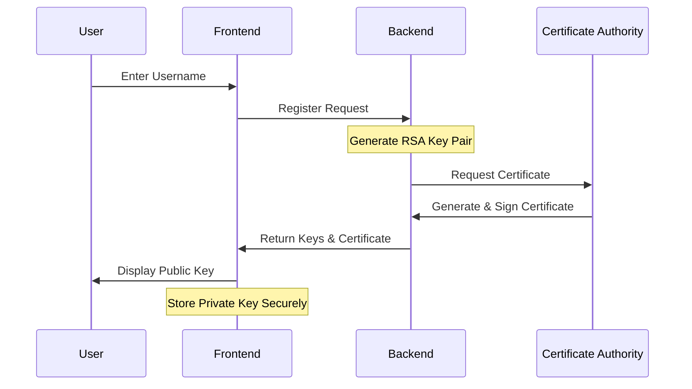
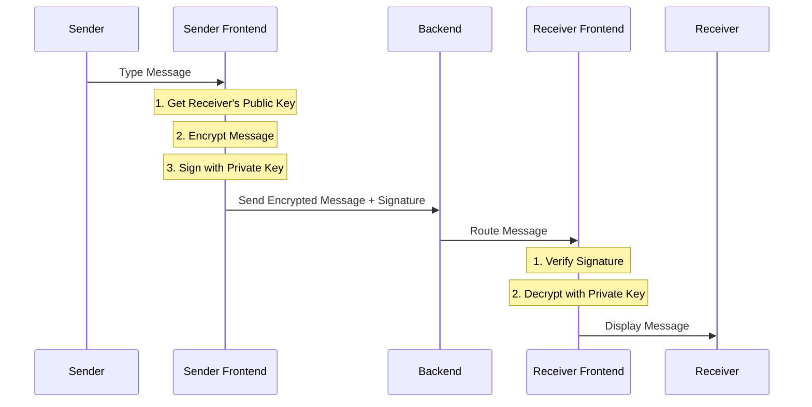
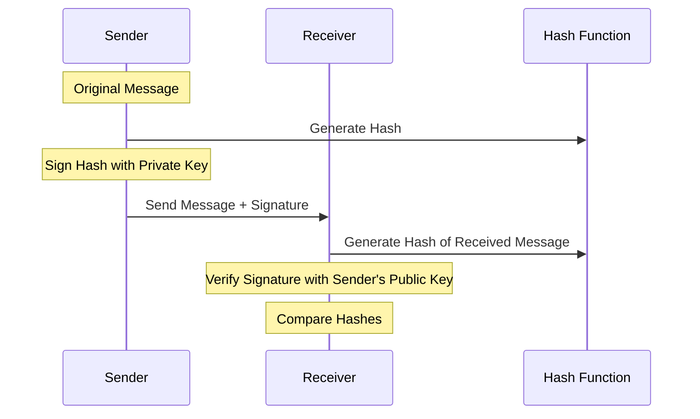
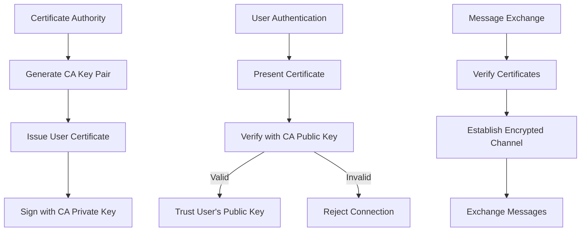
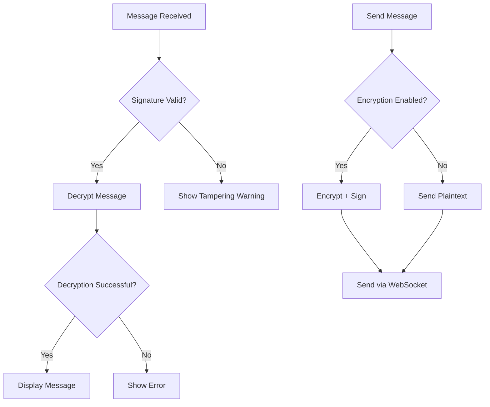

# RSA-Based Secure Messaging App Flow Diagrams

This document visualizes the key flows and algorithms in the secure messaging application using Mermaid diagrams.

## User Registration and Key Generation Flow

## Encrypted Message Flow

## RSA Algorithm Flow

### Key Generation Process
1. Generate two large prime numbers (p and q)
2. Calculate modulus: n = p * q
3. Calculate totient: φ(n) = (p-1) * (q-1)
4. Choose public exponent e (usually 65537)
5. Calculate private exponent d where (d * e) mod φ(n) = 1
6. Result:
   - Public Key: (n, e)
   - Private Key: (n, d)

### Message Encryption Process
1. Get the message (m) to encrypt
2. Obtain recipient's public key (n, e)
3. Calculate ciphertext: c = m^e mod n
4. Send encrypted message (c) to recipient

### Message Decryption Process
1. Receive encrypted message (ciphertext c)
2. Use private key (n, d)
3. Calculate original message: m = c^d mod n
4. Read the decrypted message

## Digital Signature Process

## MITM Attack Prevention

## Error Handling Flow

